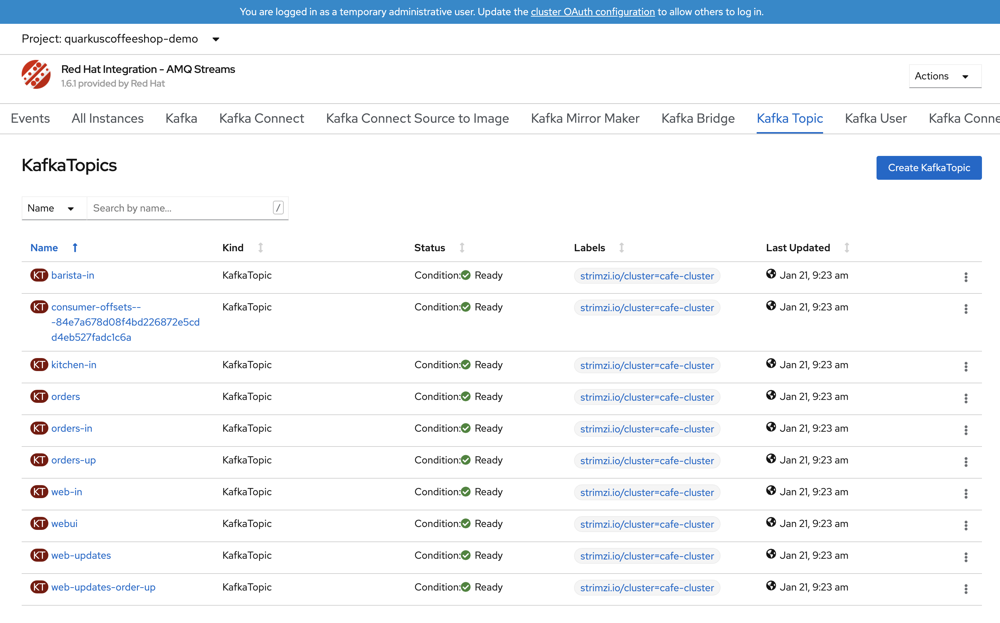
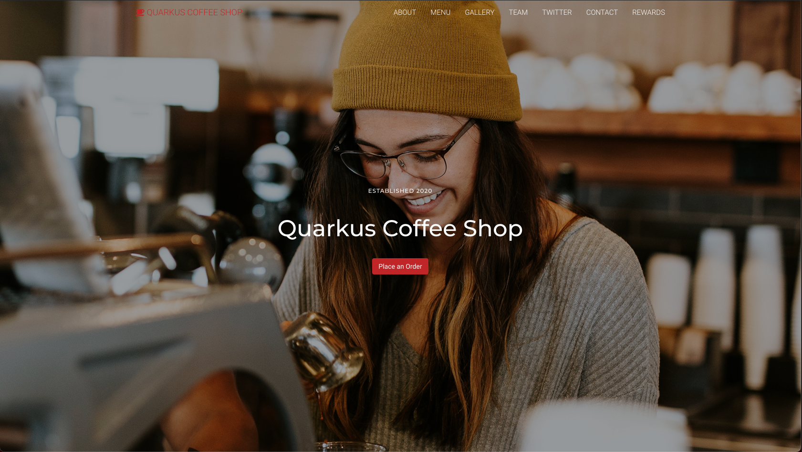

# Docs
Please see the Github Pages Site for complete documentation: [quarkuscoffeeshop.github.io](https://quarkuscoffeeshop.github.io)

QuarkusCoffeeshop Install
=========

_NOTE:_ Ansible must be installed https://docs.ansible.com/ansible/latest/installation_guide/index.html

The QuarkusCoffeeshop Ansbile Role performs a basic installation that includes the microservices for a coffeeshop, installation of the Crunchy PostgreSQL DB, AMQ Streams (Kafka.)


The QuarkusCoffeeshop Role will deploy an event-driven demo application built with Quarkus, AMQ Streams (Kafka), and MongoDB. The application deploys to OpenShift (Kubernetes.)
The source code for the  [quarkuscoffeeshop](https://github.com/quarkuscoffeeshop) application support doc can be found  [here](https://github.com/quarkuscoffeeshop/quarkuscoffeeshop-support).


Requirements
------------

* OpenShift 4.10 an up Cluster installed
* Docker or podman

Currently tested on 
-------------------
* OpenShift 4.10.24
* OpenShift Pipelines: 1.6.3
* AMQ Streams: 2.1.0-6
* Postgres Operator: v5.1.2
* OpenShift Quay: v3.7.5


Quick Start 
-----------
**Set Environment variables for standard deployment**
> This command will deploy the application on a Single cluster with the following services below. 
* AMQ Streams
* Postgres Operator configuration 
* quarkus coffeeshop helm deployment
```
$ cat >source.env<<EOF
CLUSERTER_DOMAIN_NAME=clustername.example.com
TOKEN=sha256~XXXXXXXXXXXX
ACM_WORKLOADS=n
AMQ_STREAMS=y
CONFIGURE_POSTGRES=y
MONGODB_OPERATOR=n
MONGODB=n
HELM_DEPLOYMENT=y
DELETE_DEPLOYMENT=false
EOF
$ podman run  -it --env-file=./source.env  quay.io/quarkuscoffeeshop/quarkuscoffeeshop-ansible:v4.10.24

```


**Set Environment variables for ACM WORKLOADS**
* Gogs server
* OpenShift Pipelines
* OpenShift GitOps
* Quay.io
* AMQ Streams
* Postgres Template deployment
* homeoffice Tekton pipelines
* quarkus-coffeeshop Tekton pipelines
```
$ cat >source.env<<EOF
CLUSERTER_DOMAIN_NAME=clustername.example.com
TOKEN=sha256~XXXXXXXXXXXX
ACM_WORKLOADS=y
AMQ_STREAMS=y
CONFIGURE_POSTGRES=y
HELM_DEPLOYMENT=n
DELETE_DEPLOYMENT=false
EOF
$ podman run  -it --env-file=./source.env  quay.io/quarkuscoffeeshop/quarkuscoffeeshop-ansible:v4.10.24
```

**Optional: Change namespace for helm deployments**  
`default is quarkuscoffeeshop-demo`
```
$ cat >source.env<<EOF
CLUSERTER_DOMAIN_NAME=clustername.example.com
TOKEN=sha256~XXXXXXXXXXXX
ACM_WORKLOADS=n
AMQ_STREAMS=y
CONFIGURE_POSTGRES=y
MONGODB_OPERATOR=n
MONGODB=n
HELM_DEPLOYMENT=y
NAMESPACE=changeme
DELETE_DEPLOYMENT=false
EOF
$ podman run  -it --env-file=./source.env  quay.io/quarkuscoffeeshop/quarkuscoffeeshop-ansible:v4.10.24
```


ScreenShots
------------------------------------------------




http://quarkuscoffeeshop-web-quarkus-cafe-demo.apps.example.com example



Usage
----------------
* Default web page 5.0.1-SNAPSHOT  
  * http://quarkuscoffeeshop-web-quarkus-cafe-demo.apps.example.com/
this endpoint is used to view the events coming into the cluster
* Default web page v3.3.1  
  * http://quarkuscoffeeshop-web-quarkus-cafe-demo.apps.example.com/cafe
this endpoint is used to view the events coming into the cluster
* If you deploy skip_quarkus_cafe_customermock this will automatically push events to the quarkus cafe dashboard.
* If you would like to manally push events to AMQ use the command below.
```shell
export ENDPOINT="quarkuscoffeeshop-web-quarkus-cafe-demo.apps.ocp4.example.com"
curl  --request POST http://${ENDPOINT}/order \
--header 'Content-Type: application/json' \
--header 'Accept: application/json' \
-d '{
    "beverages": [
        {
            "item": "COFFEE_WITH_ROOM",
            "name": "Mickey"
        },
        {
            "item": "CAPPUCCINO",
            "name": "Minnie"
        }
    ],
    "kitchenOrders": [
        {
            "item": "CAKEPOP",
            "name": "Mickey"
        },
        {
            "item": "CROISSANT",
            "name": "Minnie"
        }
    ]
}'
```

## Developer Notes
> To develop and modifiy code 
* OpenShift 4.10 an up Cluster installed
* Ansible should be installed on machine
* oc cli must be installed
* Ansible community.kubernetes module must be installed `ansible-galaxy collection install community.kubernetes`
* Install [Helm](https://helm.sh/docs/intro/install/) Binary
* [Postges Operator](https://github.com/tosin2013/postgres-operator) for Quarkus CoffeeShop 5.0.1-SNAPSHOT Deployments
* pip3 


Role Variables
--------------
Type  | Description  | Default Value
--|---|--
deployment_method | docker or s2i build | docker
skip_amq_install |  Skip Red Hat AMQ Install  |  false
skip_mongodb_operator_install |  Skip MongoDB Operator Install  |  false
single_mongodb_install | Skip single instance mongodb | false
skip_quarkuscoffeeshop_helm_install |  Skip quarkuscoffeeshop helm chart install  |  false
openshift_token | OpenShift login token  | 123456789
openshift_url | OpenShift target url  | https://master.example.com
project_namespace | OpenShift Project name for the quarkus-cafe | quarkus-cafe-demo
insecure_skip_tls_verify  |  Skip insecure tls verify  |  true
default_owner | Default owner of template files. | root
default_group | Default group of template files. |  root
delete_deployment  | delete the deployment and project for quarkus-cafe-demo  | false
amqstartingCSV  | Red Hat AMQ csv version  |  amqstreams.v1.6.1
mongodbstartingCSV  | MongoDB Ops Manager version  |  mongodb-enterprise.v1.8.0
config_location  | default location for application templates  | "/tmp/"
version_barista | Default container barista tag | 5.0.0-SNAPSHOT
version_counter | Default container counter tag | 5.0.1-SNAPSHOT
version_customermocker | Default container customermocker tag | 3.0.1
version_kitchen | Default container kitchen tag | 5.0.0-SNAPSHOT
version_web | Default container web tag | 5.0.1-SNAPSHOT
helm_chart_version | Version of Qaurkus Cafe Helm Chart | 3.4.4
pgsql_username | Default postgress user  | coffeshopadmin
postgres_password | this is the postgress password that will be used in deployment| must be changed
pgsql_url | default postgres URL | 'jdbc:postgresql://coffeeshopdb:5432/coffeeshopdb?currentSchema=coffeeshop'
storeid | Store id for web frontend | RALEIGH
quarkus_log_level | Quarkus coffee shop log level |  INFO
quarkuscoffeeshop_log_level | Microservice log level | DEBUG

**Download the deploy-quarkuscoffeeshop-ansible.sh shell script**
```
$ curl -OL https://raw.githubusercontent.com/quarkuscoffeeshop/quarkuscoffeeshop-ansible/master/files/deploy-quarkuscoffeeshop-ansible.sh
$ chmod +x deploy-quarkuscoffeeshop-ansible.sh
$ ./deploy-quarkuscoffeeshop-ansible.sh -d ocp4.example.com -t sha-123456789 -p 123456789 -s ATLANTA
```

**To Build container image**
``` 
podman build -t  quarkuscoffeeshop-ansible:v0.0.1 -f Dockerfile
```

**Test Container**
```
podman run  -it quarkuscoffeeshop-ansible:v0.0.1 bash or 
podman run  -it --env-file=./source.env   localhost/quarkuscoffeeshop-ansible:v0.0.1
```

**Delete old containers**
```
 podman rm $(podman ps -a | grep Exited | awk '{print $1}')
```

Troubleshooting
---------------
Force delete kafka crds after bad install
```
oc get crds -o name | grep '.*\.strimzi\.io' | xargs -r -n 1 oc delete
```

To-Do
-------
* Ansible k8s – Manage Kubernetes (K8s) objects deployment example


License
-------

GPLv3

Author Information
------------------

This role was created in 2020 by [Tosin Akinosho](https://github.com/tosin2013)


